# Production-Grade React CI/CD Pipeline 🚀

A full-stack DevOps showcase demonstrating a robust, production-ready workflow for a React application. This project bridges the gap between local development and cloud-scale deployment using industry-standard tools.

<div align="center">

<a href="http://Docker-react-env.eba-apmapbsr.us-east-1.elasticbeanstalk.com">
  
</a>
<a href="https://github.com/vikas9dev/docker-react/actions">
  
</a>
<a href="https://hub.docker.com/repository/docker/vikas9dev/docker-react/general">
  
</a>

---


</div>

---


## 🏗️ Architecture & Workflow

```mermaid
graph TD
    %% Node Definitions
    A([💻 Local Development]) -->|Git Push| B(🐙 GitHub Repo)
    B -->|Webhook| C{⚙️ GitHub Actions}
    
    subgraph CI_CD ["🚀 CI/CD Pipeline"]
        direction TB
        C --> D[🧪 Run Unit Tests]
        D -->|Success| E[🏗️ Build Prod Image]
        E -->|Push| F[🐳 Docker Hub]
    end
    
    subgraph AWS ["☁️ AWS Infrastructure"]
        direction TB
        F --> G[📦 Source Bundle]
        G --> H[⚖️ Elastic Beanstalk]
        H --> I[🖥️ EC2 / Nginx]
    end
    
    I --> J((🌐 Live Website))

    %% Premium Styling
    classDef process fill:#112240,stroke:#64ffda,color:#e6f1ff,stroke-width:2px;
    classDef git fill:#1e1e1e,stroke:#f1502f,color:#fff,stroke-width:2px;
    classDef action fill:#1e1e1e,stroke:#2088ff,color:#fff,stroke-width:2px;
    classDef docker fill:#003f8c,stroke:#2496ed,color:#fff,stroke-width:2px;
    classDef aws fill:#232f3e,stroke:#ff9900,color:#fff,stroke-width:2px;
    classDef live fill:#00d2ff,stroke:#3a7bd5,color:#000,font-weight:bold;

    class D,E,G process;
    class B git;
    class C action;
    class F docker;
    class H,I aws;
    class J live;

    style CI_CD fill:#0a192f,stroke:#3a7bd5,stroke-width:2px,stroke-dasharray: 5 5,color:#fff
    style AWS fill:#161b22,stroke:#ff9900,stroke-width:2px,stroke-dasharray: 5 5,color:#fff
```



---

## 🛠️ Tech Stack & Skills Demonstrated

### 🐳 Docker & Containerization
*   **Dual-Environment Strategy**: Specialized `Dockerfile.dev` for testing and a multi-stage `Dockerfile` for production.
*   **Optimization**: Utilized a **multi-stage build** (Node.js build agent -> Nginx runtime) to keep the production image under ~25MB.
*   **Compose Orchestration**: Managed local development environments with Docker Compose, including live-reload volumes.

### 🤖 GitHub Actions (CI/CD)
*   **Automated Testing**: Integrated Jest testing suite that runs on every push.
*   **Registry Integration**: Automated authentication and push to **Docker Hub** with version tagging.
*   **Zero-Downtime Deployment**: Configured automated deployment to AWS Elastic Beanstalk using secure repository secrets.

### ☁️ AWS Cloud Infrastructure
*   **Elastic Beanstalk (PaaS)**: Configured a managed environment using the Amazon Linux 2 platform.
*   **IAM Management**: Implemented "Principle of Least Privilege" using specific IAM roles for EC2 instances and Beanstalk services.
*   **S3 & Networking**: Managed application versioning via S3 and configured port mapping (EXPOSE 80) for Nginx proxying.

---

## 🚀 Getting Started

### Local Development
1. Clone the repository
2. Run the development environment:
   ```bash
   docker-compose -f docker-compose-dev.yml up
   ```
3. Visit `localhost:3000`

### Running Tests
```bash
docker build -t react-tests -f Dockerfile.dev .
docker run -e CI=true react-tests npm run test
```

---

## 🔧 Environment Variables & Configuration
The CI/CD pipeline requires the following GitHub Repository Secrets:
*   `DOCKER_HUB_USERNAME`
*   `DOCKER_HUB_ACCESS_TOKEN`
*   `AWS_ACCESS_KEY_ID`
*   `AWS_SECRET_ACCESS_KEY`

---

## 📝 Continuous Improvement
*   [ ] Integration of SonarQube for static code analysis.
*   [ ] Implementation of a Staging environment for PR previews.
*   [ ] Migration to Kubernetes (EKS) for advanced orchestration.

---
<div align="center">
  <p>© 2026 Developed by <a href="https://github.com/vikas9dev"><b>Vikas</b></a> • End-to-End DevOps Automation</p>
</div>

